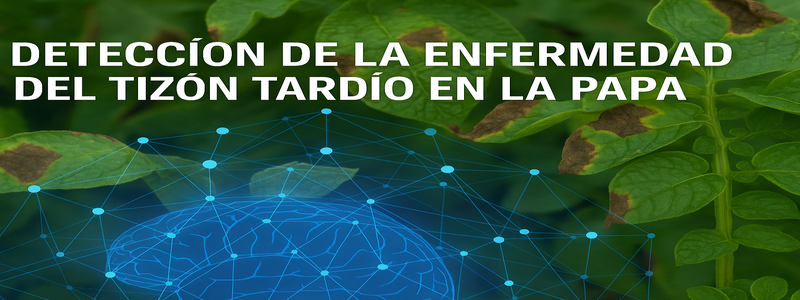

<!DOCTYPE html>
<html lang="es">
<head>
  <meta charset="UTF-8">
</head>
<body>

  <!-- TITULO Y BANNER -->
  <h1>Predicción Temprana de Enfermedad de la Papa</h1>
  

  <!-- AUTORES -->
  

    <h2>Autores</h2>
    
Andrés Felipe Escalante Portilla, Edinson Giovanny Ojeda Ortega, Breyner Santiago Peña Bello

  

  <!-- OBJETIVO -->
  

    <h2>Objetivo</h2>
    
Desarrollar un sistema automatizado de diagnóstico mediante redes neuronales convolucionales (CNN) para clasificar imágenes de hojas de papa en tres categorías: Healthy, Early Blight y Late Blight.

  

  <!-- DATASET -->
  

    <h2>Dataset</h2>
    

      Se utilizó el dataset de Kaggle “🌱 Potato Plant Diseases Data 🍂” (PlantVillage) con las siguientes clases:
      <ul>
        <li><strong>Early Blight:</strong> 1.000 imágenes</li>
        <li><strong>Late Blight:</strong> 1.000 imágenes</li>
        <li><strong>Healthy:</strong> 152 imágenes</li>
      </ul>
      <strong>Link de descarga:</strong>  
      <a href="https://www.kaggle.com/datasets/hafiznouman786/potato-plant-diseases-data/data">🌱 Potato Plant Diseases Data 🍂</a>
       
      <strong>Instrucciones de descarga:</strong>
      <ol>
        <li>Ir a la página del dataset (“🌱 Potato Plant Diseases Data 🍂”).</li>
        <li>Hacer clic en “Download” para obtener el archivo ZIP.</li>
        <li>Descomprimir localmente o en Google Colab para usar <code>ImageDataGenerator</code> con la carpeta resultante.</li>
      </ol>
      <strong>Descripción breve:</strong> Conjunto de imágenes de hojas de papa tomadas bajo condiciones variadas (iluminación, fondo). Incluye tres carpetas principales (<em>Early_blight</em>, <em>Late_blight</em>, <em>Healthy</em>) y subcarpetas con imágenes en formato JPG/PNG.
    

  

  <!-- MODELOS -->
  

    <h2>Modelos</h2>
    
Se emplearon los siguientes métodos (palabras clave):

    <ul>
      <li>Transfer Learning</li>
      <li>VGG16</li>  
      <li>EfficientNetB3</li>
      <li>Fine-Tuning</li>
      <li>CNN (Convolutional Neural Network)</li>
      <li>Data Augmentation</li>
      <li>Class Weights</li>
      <li>Early Stopping</li>
      <li>ReduceLROnPlateau</li>
    </ul>
  

  <!-- ENLACES -->
  

    <h2>Enlaces</h2>
    <ul>
      <li><strong>Colab:</strong>  
        
        <a href="https://drive.google.com/file/d/10cQ-qTSYqTFmVX-SFUUwH1ar7drUeFtX/view?usp=sharing" target="_blank">VGG16</a>
      </li>
      <li><strong>Video demostrativo:</strong>  
        <a href="https://www.youtube.com/watch?v=tu_video_demo" target="_blank">Video</a>
      </li>
      <li><strong>Diapositivas:</strong>  
        <a href="https://gamma.app/docs/Prediccion-Temprana-de-Enfermedades-de-la-Papa-ythc4bhet2pgwbj" target="_blank">Diapositivas</a>
      </li>
    </ul>
  

</body>
</html>
